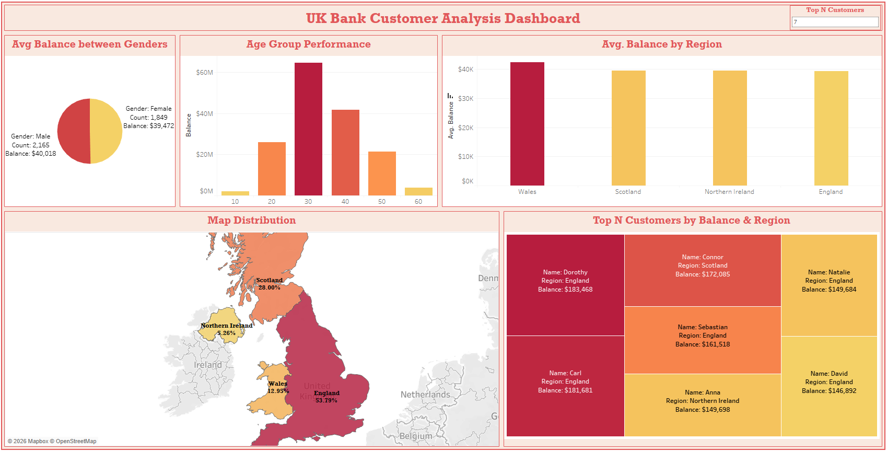

# 📊 UK Bank Customer Analysis Dashboard (Tableau)

## 🧠 Overview

This project presents an interactive customer analytics dashboard built using **Tableau** to analyze a UK bank customer dataset. The dashboard explores customer demographics, account balances, regional distribution, and high-value customer behavior through interactive visualizations and geographic analysis.

The project aims to uncover meaningful business insights that can support customer segmentation, strategic decision-making, and customer retention strategies.

---

## 📂 Dataset Description

The dataset represents customers of a UK-based bank and contains detailed customer banking information used to analyze demographics, financial behavior, regional distribution, and high-value customer segments.

### Dataset Features

| Column Name | Description |
|---|---|
| Customer ID | Unique identifier assigned to each customer |
| Name | Customer first name |
| Surname | Customer last name |
| Gender | Customer gender |
| Age | Customer age |
| Region | Geographic region where the customer resides |
| Job Classification | Customer occupation category |
| Date Joined | Date the customer joined the bank |
| Balance | Customer account balance |

### Dataset Overview

The dataset is designed for customer segmentation and financial analysis, enabling insights into:

- Customer demographics
- Regional customer distribution
- Banking balance patterns
- High-value customer identification
- Financial behavior analysis

The dataset includes customers from the following UK regions:

- England
- Scotland
- Wales
- Northern Ireland

---

## 🔗 Dashboard Preview & Live Link

---

## 📊 Dashboard Visualizations & Insights

### 🔹 Customer Balance by Gender (Pie Chart)

Compares the average account balance and customer distribution between male and female customers.

💡 **Insight:** Male and female customers maintain very similar average balances, with male customers holding a slightly higher overall balance.

---

### 🔹 Customer Balance by Age Group (Bar Chart)

Analyzes customer balances across different age groups to identify the most financially active segment.

💡 **Insight:** Customers within the **30–40 age range** hold the highest balances, making them the bank’s strongest financial segment.

---

### 🔹 Average Balance by Region (Bar Chart)

Displays the average customer balance across UK regions.

💡 **Insight:** Wales records the highest average balance, while England, Scotland, and Northern Ireland maintain relatively similar balance levels.

---

### 🔹 Customer Distribution Across the UK (Choropleth Map)

Visualizes customer distribution percentages across UK regions using an interactive geographic map.

💡 **Insight:** England represents the largest share of customers, while Northern Ireland has the lowest customer concentration.

---

### 🔹 Top Customers by Balance & Region (Treemap)

Highlights the highest-value customers based on account balances and regional distribution.

💡 **Insight:** A small number of customers contribute a significant portion of total balances, with most high-value customers concentrated in England and Scotland.

---

## 🔑 Key Takeaways

- Customers aged 30–40 represent the most valuable segment.
- England dominates customer volume, but Wales leads in average balance.
- A small group of customers drives a large share of total balances.
- Clear opportunity exists for targeted retention and premium banking products.

---

## 💼 Business Impact & Recommendations

- Focus marketing campaigns on the 30–40 age group as they hold the highest balances.
- Introduce premium financial products in Wales due to higher average balances.
- Strengthen customer acquisition strategies in Northern Ireland where penetration is lowest.
- Identify high-value customers in England & Scotland for loyalty programs.

---

## 🛠️ Tools & Technologies

- Tableau
- Data Visualization
- Geographic Analysis
- Customer Segmentation
- Dashboard Design
- Data Binning
- Geographic Mapping

---

## 👩‍💻 Author

**Marwan Aly Mohamed**  
Data Scientist | Data Analyst
